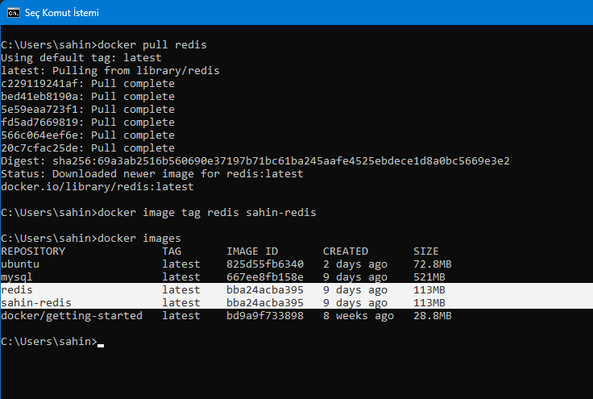
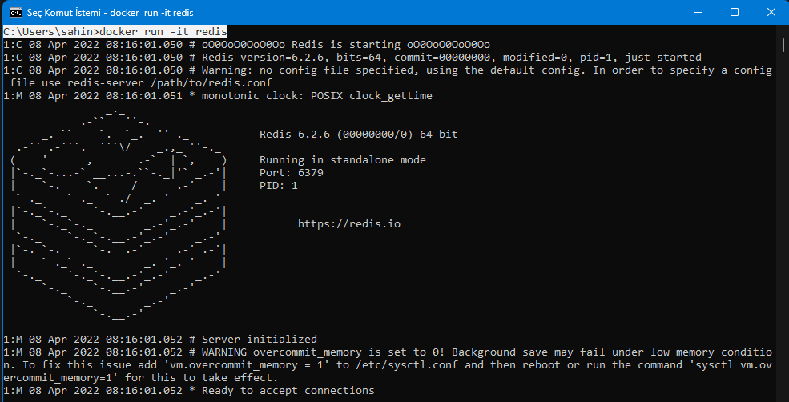

# Docker Basics

## Basic Kullanımlar

### Çekme/İndirme (Pull)
```
docker pull php // PHP'yi dockerHub'tan çeker
docker run php // Eğer Php varsa çalıştırır yoksa yükler ve sonra çalıştırır.
docker pull ubuntu // Ubuntu'yu dockerHub'tan çeker
```

### Çalıştırma (Run)
Çekilen image'ı çalıştırır.
```
docker run redis
```

### Versiyon Seçme (Version)
Spesifik bir versiyon belirtilebilir.
```
docker run redis:<version>

```

### Özel İsimlendirme (Tag)

```
docker image tag redis <my-tag>
```


### -d Flag (--detach , -d)
Arkaplanda çalıştırma
```
docker run -d redis
```

### -it Flag (Interactive Terminal)
Çalıştırır ve terminale girer.
```
docker run -it redis
```


### Processleri Listeme
Tüm processleri listeler.
 ```
 docker ps -a
 docker ps --all
 ```


### Containerları Listeler
Tüm containerları listeler.
 ```
 docker container ls -aq
 ```

### Container Silmek
Bir containerı siler.
```
docker container rm <containerID|containerName>
```
Birden fazla containerı siler.
```
docker container rm <containerID> <containerID> <containerID>
```
Tüm containerları siler.
```
docker container rm ${docker container ls -aq}
```

### Çalışan Containerı Durdurma

```
docker stop <containerID>
```

### Container Loglarını İzlemek

Arkaplanda çalışan container loglarını izlemek.
 ```
 docker attach <containerID>
 //Komut sonrasında çıkan logları gösterir.
 ```
 Tüm logları izleme
 ```
 docker container logs <conatinerID>
 //Başladığından itibaren çıkan tüm logları izleme
 ```

### Container'a Ait Bilgilerin Alınması

```
docker inspect <containerID|containerName>
```

### Image Silmek
Bir imageı siler.
```
docker container rmi <imageName|imageID>
```

### Port Mapping

*-p PORT*

```
docker run -p <IC_PORT>:<DIS_PORT> mongo
```

### Volume Mapping
Docker host üzerinde containerlar stateless olarak çalışırlar. Containerlar kapatıldığında kayıt ettiğimiz bilgiler silinir. Bunun önüne geçebilmek için volume mapping işlemi yapılması gerekir.

Genel olarak dokümantasyon(DockerHub) içerisinde volume mapping yolları verilir.

*-v VOLUME*

```
docker run -v <MY_HOST>:<DOCKER_HOST> mongo
```

*Örnek:* 
```
docker run -v /opt/data:/data/db -p 27017:27017 -it mongo

//27017 Portunda
//Interactive Terminal ile
// /opt/data içerisine volume mapping ile
// mongo başlatıldı!
```

### Environment Variable Belirtme (-e Flag)

```
docker run -e MYSQL_ROOT_PASSWORD=123456 -d mysql
```

### Containerları Link ile Birbirine Bağlama

Önce bağlanılacak container isimlendirilerek çalıştırılır.

```
docker run --name mysql-server -p 3306:3306 -v /my/own/datadir:/var/lib/mysql -e MYSQL_ROOT_PASSWORK=123456 -d mysql 
```
Daha sonra bağlanacak olan container oluşturulur.
```
docker run --name phpmyadmin-app -p 8000:80 --link mysql-server:db -d phpmyadmin/phpmyadmin
```
``:db`` bir alias tanımıdır.


## Network Türleri

Docker'da 3 network türü vardır. Bridge, none ve host network.

### Bridge Network(Standart olarak çalışan)
```
docker run mongo
```
### None Network
Dışarıdan erişilemez.
```
docker run mongo --network:none
//Note network
```
### Host Network
```
docker run mongo --network:host
```

### Kullanıcı Tanımlı Network
```
docker run --driver bridge --subnet 182.18.0.0/16 --gateway 182.18.0.1 my-app-network
```

### Network Listeme
Tüm networkleri listeler.
```
docker network ls
docker network list
```

### Network Silmek 
Bir networkü siler.
```
docker network rm <networkName|networkID>
docker network list
```

### Network Ayrıntılarını Öğrenme
```
docker inspect <networkID|networkName>
```

